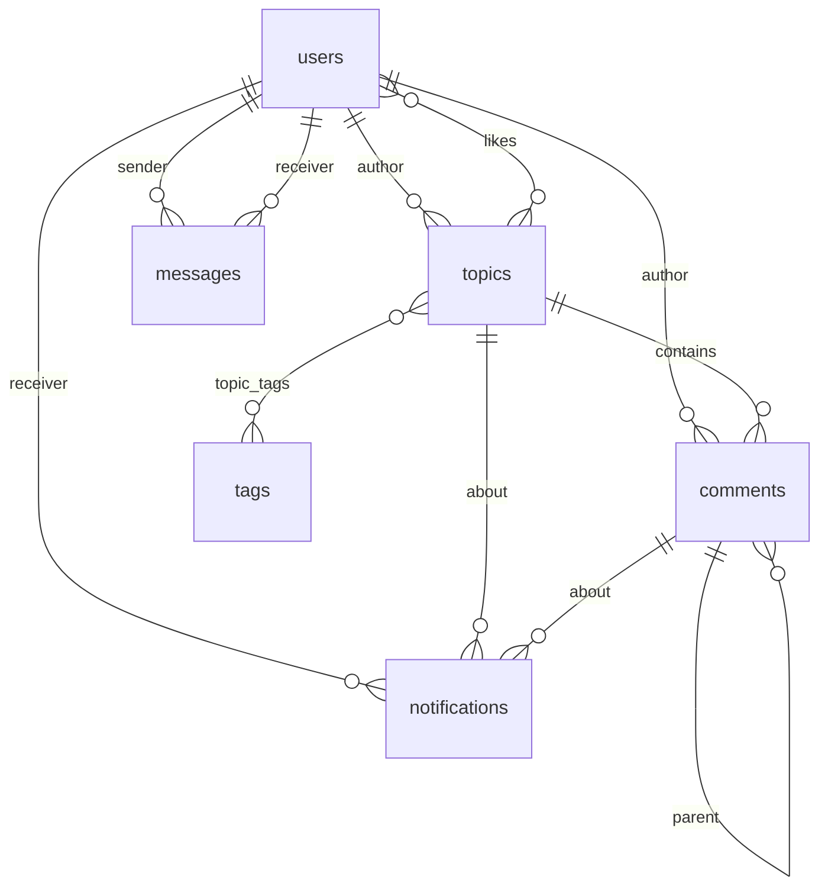

# Inkwell 论坛系统设计文档

> 本文件原为 `2026-05-15-blog-to-forum-design.md`（博客改造为论坛的设计决策）。改造完成后系统又经历了多轮迭代，原文档与代码严重脱节，故整体重写为**当前系统设计文档**。历史改造过程见同目录 `../plans/implementation-record.md`。

## 1. 系统概述

**Inkwell** 是一个无版块的扁平社区论坛。所有注册用户可发帖、回复、点赞、私信；管理员额外拥有置顶与加精权限。

设计取向：**极简优先**。没有版块分区、没有 RBAC 角色体系、没有富文本编辑器，用最小的功能集合覆盖"发帖 + 讨论 + 私聊 + 通知"这条主链路。

### 技术栈

| 层 | 技术 |
| --- | --- |
| 前端 | Vue 3（`<script setup>`）+ Vite 6 + Vue Router 4 + Pinia 3 + Axios |
| 后端 | FastAPI + SQLAlchemy 2.0 + Pydantic v2 |
| 数据库 | PostgreSQL 16 |
| 认证 | JWT（HS256，24h）+ bcrypt |
| Markdown | marked + DOMPurify（前端）/ bleach（后端） |
| 限流 | slowapi |
| 部署 | Docker Compose（PG + FastAPI + nginx） |

### 分层

```
浏览器
  │  Vue 3 SPA（Vue Router 12 路由 / Pinia auth / 10 个 API 模块）
  ▼  HTTP + JWT（Authorization: Bearer）
FastAPI（main.py 全部路由）
  │  依赖注入：get_db / get_current_user / get_optional_user / require_admin
  ▼
crud.py（纯数据库操作，无 HTTP 概念）
  │
  ▼  SQLAlchemy 2.0 ORM
PostgreSQL 16
```

后端刻意保持"胖路由 + 瘦 CRUD"的形态：`main.py` 承担鉴权、净化、限流、错误映射，`crud.py` 只做数据读写且不抛 `HTTPException`。这样 `crud.py` 的每个函数都可以脱离 HTTP 上下文复用与测试。

## 2. 数据模型



### users

| 列 | 类型 | 说明 |
| --- | --- | --- |
| id | Integer PK | |
| username | String unique index | |
| password_hash | String | bcrypt |
| avatar | String | 图片 URL，默认 `""` |
| bio | String | 默认 `""` |
| github_url | String | 默认 `""`，校验必须是 http(s) URL |
| is_admin | Boolean | 默认 false |
| topic_count | Integer | 冗余计数，原子更新 |
| comment_count | Integer | 冗余计数，原子更新 |
| created_at | DateTime | UTC |

`topic_count` / `comment_count` 是刻意的反范式设计：用户主页要显示统计，实时 `COUNT` 每次访问都要扫两张表。代价是增删帖子/评论时必须同步维护，实现上用 `User.topic_count + 1` 这类 SQL 表达式而非"读出来加一再写回"，避免并发丢更新；减少时用 `case()` 兜底不小于 0。

### topics

| 列 | 类型 | 说明 |
| --- | --- | --- |
| id | Integer PK | |
| title | String | 写入前经 bleach 净化 |
| content | Text | Markdown 源码，写入前经 bleach 净化 |
| author_id | Integer FK → users.id | |
| view_count | Integer | 详情页每次访问 +1 |
| is_pinned | Boolean | 管理员置顶，列表排序第一优先级 |
| is_featured | Boolean | 管理员加精，仅作展示标记 |
| created_at / updated_at | DateTime | `updated_at` 有 `onupdate` |

`content` 存的是 **Markdown 源码**，不是 HTML。前端用 `marked` 渲染，所以 bleach 的白名单里保留了 `h1`-`h6`、`pre`、`code`、`blockquote`、`table` 等 Markdown 产物标签——若存的是纯文本，这个白名单会显得过于宽松。

### comments

| 列 | 类型 | 说明 |
| --- | --- | --- |
| id | Integer PK | |
| content | Text | |
| topic_id | Integer FK → topics.id | 有索引 |
| user_id | Integer FK → users.id | |
| parent_id | Integer FK → comments.id，可空 | 自引用，有索引 |
| created_at | DateTime | |

`parent_id` 实现楼中楼。前端 `CommentItem.vue` 用 `v-if="depth < 10"` 限定了嵌套深度，超过 10 层的回复不再继续递归渲染。`username` 是 ORM 上的 `@property`，转发 `author.username`，供 Pydantic 直接从 ORM 对象构造响应。

### likes

`user_id` + `topic_id` 复合主键，无独立 id。复合主键天然保证"同一用户对同一帖子只能点一次赞"，这是幂等性的实现基础——重复插入会触发 `IntegrityError`，`like_topic()` 捕获后回滚并返回当前计数，不报错。

### notifications

| 列 | 类型 | 说明 |
| --- | --- | --- |
| user_id | FK → users.id，ondelete CASCADE | |
| type | String | 目前只有 `"reply"` |
| topic_id | FK → topics.id，ondelete CASCADE | 可空 |
| comment_id | FK → comments.id，ondelete CASCADE | 可空 |
| is_read | Boolean | |

索引 `(user_id, is_read)`，服务"查未读数"这个最高频查询。

### messages

| 列 | 类型 | 说明 |
| --- | --- | --- |
| sender_id / receiver_id | FK → users.id | 双向索引 `(sender_id, receiver_id)` |
| content | Text | |
| is_read | Boolean | 索引 `(receiver_id, is_read)` |

私信不分会话表，靠 `(sender_id, receiver_id)` 对推算出会话。会话列表用两个子查询实现：

- 子查询 A：按"对方 id"分组取 `MAX(Message.id)`，得到每个会话的最新一条消息
- 子查询 B：按 `sender_id` 分组统计未读数（只算发给自己的）
- 主查询把 A、B join 到 `users` 上，按最新消息时间倒序

不用 `self-join + NOT EXISTS` 是因为在 PG 上分组取最大 id 再回查的写法更易于走索引。

### tags / topic_tags

`tags` 有 `name` 与 `slug` 两个唯一索引；`slug = name.lower().replace(" ", "-")`。`topic_tags` 是多对多关联表（复合主键）。注意 slug 的生成方式对中文标签不起作用（中文没有大小写与空格），所以 `#前端` 这类标签的 slug 就是它自身。

### 迁移策略

**没有使用 Alembic。** `database.py` 的 `ensure_schema()` 在应用启动时：

1. 尝试 `GRANT CREATE ON SCHEMA public TO CURRENT_USER`（PG 15+ 收紧了 public schema 权限；云数据库通常不允许该语句，失败只记警告）
2. `Base.metadata.create_all()` 建缺失的表
3. 逐条执行幂等的 `ALTER TABLE ... ADD COLUMN IF NOT EXISTS`，补齐 `comments.parent_id`、`topics.is_pinned`、`topics.is_featured`

代价是没有版本回滚能力，收益是零配置启动。新增字段时必须同步扩充第 3 步的语句列表，否则老库不会被补列。

## 3. API 设计

统一前缀 `/api/`，共 29 个端点（另有 `GET /` 返回服务标识）。错误响应统一为 `{"detail": "..."}`；404 / 500 / 429 有全局异常处理器。

### 认证

| 方法 | 路径 | 认证 | 限流 | 说明 |
| --- | --- | --- | --- | --- |
| POST | `/api/auth/register` | 否 | 5/min | 用户名冲突返回 409 |
| POST | `/api/auth/login` | 否 | 10/min | 返回 `{access_token, token_type}` |
| GET | `/api/auth/me` | 是 | — | |
| PUT | `/api/auth/me` | 是 | — | 仅 avatar / bio / github_url |
| PUT | `/api/auth/password` | 是 | 5/min | 需校验原密码 |

登录接口**只返回 token，不返回用户信息**。前端拿到 token 后立刻再调一次 `/api/auth/me` 取完整资料（含 `id`、`is_admin`）。这个两步设计让 token 保持最小载荷，代价是前端多一次往返。

### 帖子

| 方法 | 路径 | 认证 | 说明 |
| --- | --- | --- | --- |
| GET | `/api/topics` | 否 | `?page=&size=&q=&tag=` |
| GET | `/api/topics/{id}` | 可选 | 详情 + 评论树 + `is_liked` + tags |
| GET | `/api/topics/{id}/edit` | 是 | 取原始内容，作者或管理员 |
| POST | `/api/topics` | 是 | 10/min |
| PUT | `/api/topics/{id}` | 是 | 作者或管理员，否则 403 |
| DELETE | `/api/topics/{id}` | 是 | 返回 204 |
| PUT | `/api/topics/{id}/pin` | 管理员 | 切换置顶，返回新状态 |
| PUT | `/api/topics/{id}/featured` | 管理员 | 切换加精，返回新状态 |

`GET /api/topics/{id}` 用 `get_optional_user`：未登录也返回 200，只是 `is_liked` 恒为 false。这是"公开可读但需登录才能互动"的标准做法，避免为登录状态准备两套端点。

列表排序固定为 `is_pinned DESC, created_at DESC` —— 置顶帖永远排最前，无其他排序模式。

### 评论 / 点赞

| 方法 | 路径 | 认证 | 说明 |
| --- | --- | --- | --- |
| POST | `/api/comments` | 是 | 10/min，触发通知 |
| DELETE | `/api/comments/{id}` | 是 | 作者或管理员，级联删除所有子回复 |
| POST | `/api/likes/{topic_id}` | 是 | 幂等 |
| DELETE | `/api/likes/{topic_id}` | 是 | 幂等 |

### 标签 / 用户 / 上传

| 方法 | 路径 | 认证 | 说明 |
| --- | --- | --- | --- |
| GET | `/api/tags` | 否 | 含每个标签的帖子数，按数量倒序 |
| GET | `/api/users/{username}` | 否 | 资料 + 最近 20 篇帖子 |
| POST | `/api/upload/avatar` | 是 | 10/min，≤2MB |

### 通知 / 私信

| 方法 | 路径 | 认证 | 说明 |
| --- | --- | --- | --- |
| GET | `/api/notifications` | 是 | 分页 |
| GET | `/api/notifications/unread-count` | 是 | |
| PUT | `/api/notifications/{id}/read` | 是 | |
| PUT | `/api/notifications/read-all` | 是 | |
| POST | `/api/messages` | 是 | 10/min，`{receiver, content}` |
| GET | `/api/messages` | 是 | 会话列表 + 每会话未读数 |
| GET | `/api/messages/unread-count` | 是 | |
| GET | `/api/messages/{username}` | 是 | 读取后自动标记已读 |
| PUT | `/api/messages/{username}/read` | 是 | |

**路由声明顺序有约束**：`/api/messages/unread-count` 必须声明在 `/api/messages/{username}` 之前。FastAPI 按声明顺序匹配，反了的话 `unread-count` 会被当作用户名吃掉，返回 404。同类字面量与路径参数并存时都要注意。

## 4. 前端设计

### 路由（12 条，全部懒加载）

| 路径 | 视图 | 需登录 |
| --- | --- | --- |
| `/` | HomeView | |
| `/topic/new` | TopicEditView | ✓ |
| `/topic/:id` | TopicDetailView | |
| `/topic/:id/edit` | TopicEditView | ✓ |
| `/notifications` | → 重定向到 `/messages` | |
| `/messages` | MessagesView | ✓ |
| `/messages/:username` | ChatView | ✓ |
| `/login` | LoginView | |
| `/register` | RegisterView | |
| `/profile/edit` | ProfileEdit | ✓ |
| `/user/:username` | UserProfile | |
| `/:pathMatch(.*)*` | NotFoundView | |

`router.beforeEach` 用 Vue Router 4 的**返回值**写法（不是 `next()` 回调），无 token 时返回

```javascript
{ name: "login", query: { redirect: to.fullPath } }
```

`afterEach` 把 `document.title` 设为 `"{meta.title} · Inkwell"`。

### 状态与数据流

只有一个 Pinia store（`stores/auth.js`），持有 `user` 与 `token`，并同步落到 `localStorage` 以支撑刷新恢复。其余跨组件状态（toast、confirm）用模块级 `reactive` 对象而非 Pinia —— 它们不需要 devtools 追踪，也不需要 SSR 隔离。

```
localStorage.token
      │
      ▼
api/client.js 请求拦截器 ── 注入 Authorization: Bearer
      │
      ▼
FastAPI
      │  401
      ▼
api/client.js 响应拦截器
      ├─ 清理 localStorage
      ├─ 派发 window CustomEvent("auth-expired")  ← App.vue 监听后清 Pinia、停轮询
      └─ 硬跳转 /login?redirect=<当前路径>
```

登录/注册接口被排除在 401 重定向之外，否则输错密码会被直接弹走，用户看不到错误提示。

### 视图与组件

| 视图 | 职责 |
| --- | --- |
| HomeView | 帖子列表、标签筛选栏、搜索、分页、骨架屏 |
| TopicDetailView | Markdown 渲染、楼中楼评论、点赞、标签、作者/管理员的编辑删除与置顶加精按钮 |
| TopicEditView | 发帖/编辑复用，textarea + 实时预览（DOMPurify 净化）、TagInput |
| MessagesView | 统一收件箱：通知与私信合并后按时间倒序 |
| ChatView | 单会话气泡对话，10s 轮询，Enter 发送 |
| UserProfile | 资料 + 统计 + TA 的帖子 + "发私信"入口 |
| ProfileEdit | 头像上传（blob 预览）、简介、GitHub、改密 |

| 组件 | 职责 |
| --- | --- |
| CommentItem | 递归渲染子回复，depth 控制缩进，内联回复表单 |
| TagInput | `v-model` 标签编辑器，回车/逗号添加，Backspace 删除，热门标签建议 |
| AppToast / ConfirmDialog / BackToTop | 全局交互组件，在 App.vue 挂载一次 |

`NotificationsView.vue` 曾是未挂路由的死代码（通知已并入统一收件箱），已于 2026-09-26 从 `views/` 删除。

### 主题系统

`style.css` 定义约 60 条 CSS 变量，两套色板：

- 亮色「暖纸」：背景 `#f7f3ec`，主色 `#b8431f`（砖红）
- 暗色「深墨」：背景 `#161310`，主色 `#e07a4c`

通过 `data-theme="dark"` 切换。首次访问读 `localStorage.theme`，没有则跟随 `prefers-color-scheme`。字体为 Fraunces（标题）/ Manrope（正文）/ JetBrains Mono（代码），自 Google Fonts 引入。

## 5. 关键机制

### 认证与权限

三层依赖：

| 依赖 | 未认证时 | 用途 |
| --- | --- | --- |
| `get_current_user` | 401 | 所有受保护路由 |
| `get_optional_user` | 返回 `None` | 公开路由但需要登录态（如 `is_liked`） |
| `require_admin` | 401 / 403 | 管理员专属操作 |

资源级鉴权收敛成两个 helper：`_author_or_admin(topic, user)` 与 `_comment_author_or_admin(comment, user)`，条件统一是"我是作者 **或** 我是管理员"，不满足即 403。

JWT 的 `sub` 声明写入时是 `str(user.id)`，读出时显式 `int()` 转换——JWT 规范要求 `sub` 为字符串，但数据库主键是整型，不转换会导致 `filter_by(id="3")` 查出空结果。

### 通知

评论时按三条规则生成通知记录：

1. 通知帖子作者（自己评论自己的帖子除外）
2. 通知被回复的评论作者（自己回复自己除外）
3. 若被回复者就是帖子作者，跳过——避免同一人收到两条重复通知

评论与通知在**同一个事务**内提交，保证不出现"评论成功但没有通知"的中间态。

### 私信与统一收件箱

前端 `MessagesView` 并发拉取 `/api/notifications` 与 `/api/messages`，把两者归一成统一的展示结构（`type: "notification" | "message"`）后按时间排序，渲染在同一个列表里。通知头像用品牌符号 `✦` 与真实用户区分。

点击行为分派：通知 → 标记已读并跳帖子详情；私信 → 跳 `/messages/{username}`。

导航栏角标显示的是**未读通知 + 未读私信之和**，每 30s 轮询一次。

### 标签

发帖时 `get_or_create_tags()` 按 slug 查重，不存在则新建。`GET /api/tags` 用 `outerjoin` + `GROUP BY` 统计每个标签的帖子数并按数量倒序，供首页标签栏与发帖页的"热门标签"建议共用。

### Markdown 与内容净化

双层过滤，职责不同：

| 层 | 工具 | 时机 | 目的 |
| --- | --- | --- | --- |
| 后端 | bleach 白名单 | 写入时 | 信任边界。落库内容已安全，任何读取路径都无法注入 |
| 前端 | DOMPurify | 渲染时 | 防御性兜底 + 预览净化 |

后端白名单保留了 Markdown 会产出的标签（`pre`/`code`/`table`/`blockquote`/`h1`-`h6`），属性只放行 `a[href,title]`、`img[src,alt]`、`code[class]`，协议限定 `http`/`https`/`mailto`，其余一律 strip。

### 文件上传

头像上传的限制逐层收紧：声明 content-type 在白名单 → 读取字节数 ≤2MB → 校验图片魔术字节 → 以 UUID 重命名落盘（避免原始文件名带来的路径穿越与覆盖，**扩展名也由检测出的真实格式决定**：`EXT_BY_TYPE[detected]`，不信任 `file.filename`）。文件存 `backend/uploads/avatars/`，通过 `app.mount("/uploads", StaticFiles(...))` 静态托管，nginx 与 vite 各自反代该前缀。

> 魔术字节校验由 `main.py` 的 `_detect_image_type()` 实现（jpeg/png/gif/webp 的文件头比对）。早期版本误用了不存在的 `imghdr.from_buffer()` 导致端点必然 500，2026-09-26 已改为纯手动识别，不再依赖 `imghdr`（该模块在 Python 3.13 已移除）。

## 6. 安全

| 项 | 措施 |
| --- | --- |
| 密码存储 | bcrypt（自带 salt） |
| 会话 | JWT HS256，24h 过期，`SECRET_KEY` 取自环境变量 |
| XSS | 后端 bleach 白名单 + 前端 DOMPurify 双层 |
| 暴力破解 | slowapi 限流：注册 5/min、登录 10/min、改密 5/min、写操作 10/min |
| CSRF | 不使用 Cookie 承载凭证，token 由前端显式放入请求头 |
| 越权 | `_author_or_admin` / `_comment_author_or_admin` / `require_admin` 三处收口 |
| 上传 | 类型白名单 + 大小上限 + 魔术字节校验 + UUID 重命名 |
| CORS | `CORS_ORIGIN` 环境变量，默认仅 `localhost:5173` |

## 7. 已知技术债

按影响排序。这些是当前代码中确实存在的问题，不是设计取舍。

### 已修复的重要回归

**1. `schemas.py` 使用了 `Field()` 却没有导入它** —— 2026-09-26 修复

`schemas.py` 第 3 行原本是 `from pydantic import BaseModel, field_validator`，而 `MessageCreate`（183–184 行）写成：

```python
receiver: str = Field(min_length=1, max_length=20)
content: str = Field(min_length=1, max_length=5000)
```

`Field` 在类体执行时就要被解析，所以 `import schemas` 直接抛 `NameError: name 'Field' is not defined`。又因为 `main.py` 从 `schemas` 导入，**`import main` 失败、uvicorn 根本起不来**——这不是某个接口不可用，是整个服务无法启动。

该回归由 `6f521c6`（2026-06-19）引入：那次提交给 `MessageCreate` 补了长度校验，却漏了扩展导入。修复即把导入行改为：

```python
from pydantic import BaseModel, Field, field_validator
```

修复后实测：`import main` 通过（35 条路由），`MessageCreate` 对空字符串与超长字符串均正确抛 `ValidationError`。

**2. 头像上传端点必然 500（imghdr）** —— 2026-09-26 修复

`upload_avatar` 原来调用不存在的 `imghdr.from_buffer(content)`（`imghdr` 只有 `what()`，且该模块在 Python 3.13 已移除），端点必然 500。已改为 `main.py` 模块级的 `_detect_image_type()`，手动比对 jpeg/png/gif/webp 魔术字节，不引入 Pillow / filetype 等新依赖。

**3. `get_topics()` / `get_topics_by_user()` 的 N+1 查询** —— 2026-09-26 修复

列表原来每条帖子额外发 3 次查询（评论数、点赞数、最后评论时间），一页 10 条即 30+ 次往返。已抽出 `crud._topic_stats()`，对 `comments`、`likes` 做 `GROUP BY` 聚合批量查询。实测一页 10 条从 **32 次查询降到 5 次**（计数 1 + 取数 1 + 统计 3），且不随页大小增长。

**4. `views/NotificationsView.vue` 死代码** —— 2026-09-26 修复

约 300 行、无路由无引用的遗留视图，已删除。

**5. `highlight.js` 接线失效（marked v5+ 移除 `highlight` 选项）** —— 2026-09-26 修复

`marked.setOptions({ highlight })` 在 `marked@15` 下被静默忽略。已在 `TopicDetailView.vue` 改用 `marked.use({ renderer: { code({text, lang}) } })`，在自定义 renderer 里直接跑 hljs 并输出带 `hljs language-*` class 的 `<pre><code>`。注意 `TopicEditView` 的实时预览从未接 hljs，仍无高亮（历史行为，未改）。

**6. 三个 `@bytemd/*` 孤儿依赖** —— 2026-09-26 修复

`@bytemd/vue-next`、`@bytemd/plugin-gfm`、`@bytemd/plugin-highlight`（ByteMD 是博客时期的编辑器，论坛改造后零引用）已从 `package.json` 移除并同步 lockfile，实测卸载 115 个包。

**7. 头像落盘扩展名取自用户文件名** —— 2026-09-26 修复

`upload_avatar` 原来用 `ext = os.path.splitext(file.filename)[1]`，「真实 PNG 内容 + `avatar.html` 文件名」会让 `StaticFiles` 以 `text/html` 返回该文件（内容是真图片所以无法直接执行脚本，但响应头状态本身不该存在）。已改为 `filename = f"{uuid.uuid4()}{EXT_BY_TYPE[detected]}"`，扩展名由检测出的真实格式决定。这是第 2 项修复的跟进——同一个函数里"因为 500 而没暴露"的第二个问题。

**8. `TopicDetailView` 的 chunk 达 980 kB（gzip 316 kB）** —— 2026-09-26 修复

根因是 `import hljs from "highlight.js"` 走全量入口，把约 190 种语言全部打包，`vite build` 会报超 500 kB 警告。已改用 `highlight.js/lib/core` + 按需 `registerLanguage()` 23 种常用语言，实测 chunk 降到 **123.77 kB（gzip 39.59 kB）**。注：`github-dark.css` 主题硬编码，亮色主题下代码块仍为深色（样式取舍，未改）。

### 仍未解决

**9. 无测试、无 linter。** 后端未接 pytest，前端未接 Vitest，也没有 flake8/black/eslint 配置。

**10. 没有版本化迁移。** `ensure_schema()` 只做"加列不删列"的幂等变更，无法回滚、无法重命名列、无法改类型。字段变更累积到一定规模后需要引入 Alembic。

**11. `main.py` 承载全部 29 个路由**，已近 500 行。按领域拆分成 `routers/` 下的 `APIRouter` 是自然的下一步。

**12. 楼中楼深度只在客户端设限。** `CommentItem.vue` 用 `depth < 10` 停止递归渲染，但后端 `create_comment` 不校验层级，`parent_id` 可以指向任意深度的评论。也就是说深度超过 10 层的回复能成功写入数据库，却在界面上永远看不到——数据与视图不一致。若要彻底解决，应在写入侧限制 `parent_id` 的深度，或改为超过阈值后平铺展示并标注"回复 @某人"。
